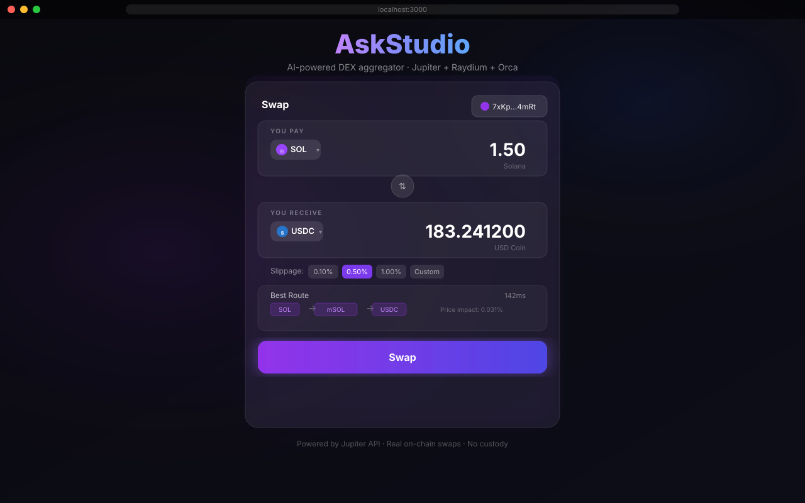
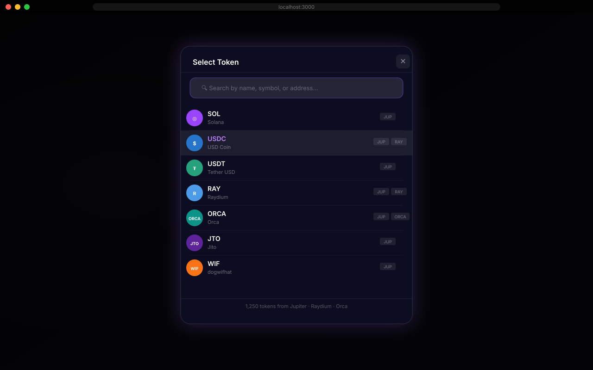
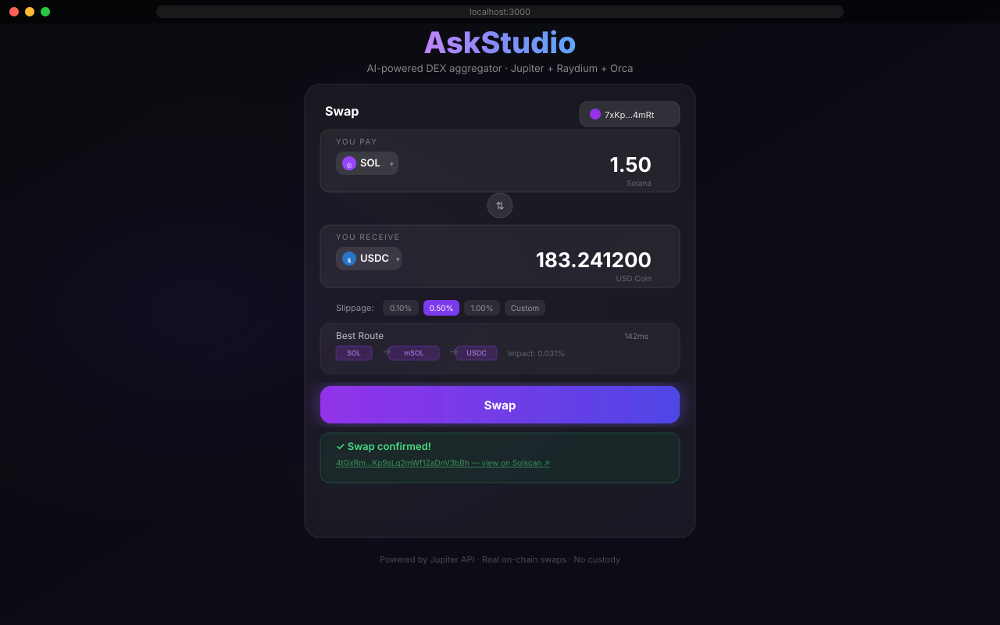
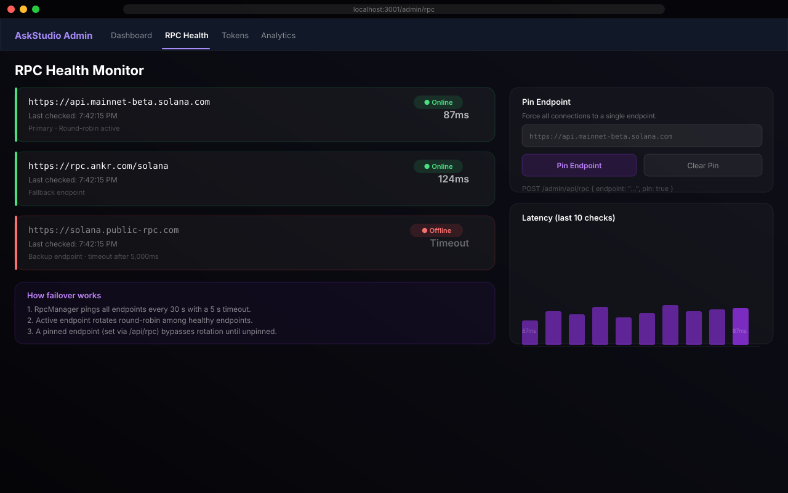
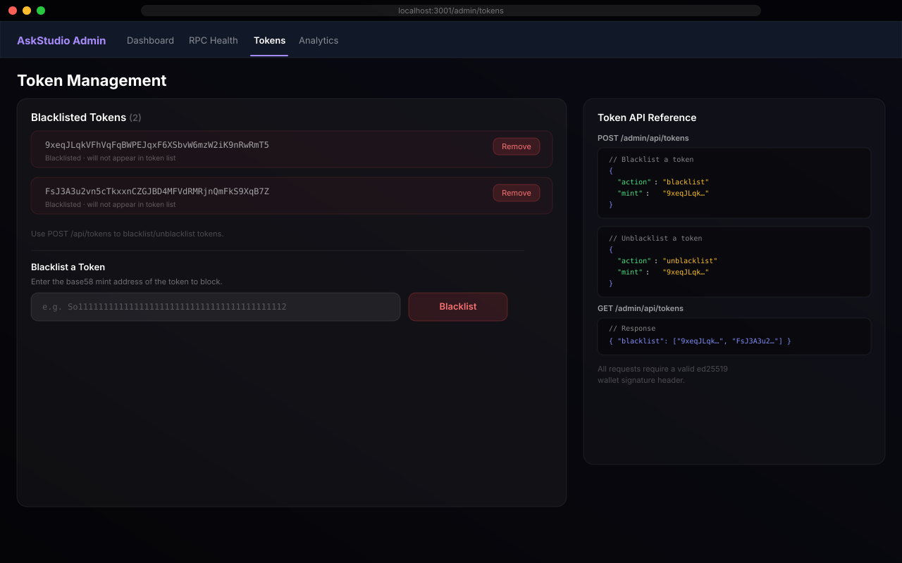
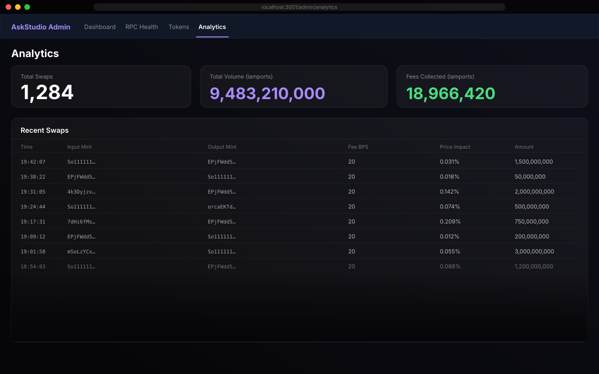
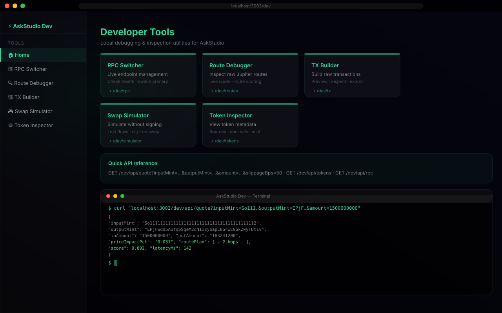

# AskStudio — User Guide

Step-by-step instructions for every dashboard and feature in AskStudio.

---

## Table of Contents

- [Quick Start](#quick-start)
- [Web App — Swap UI](#web-app--swap-ui-localhost3000)
  - [Connecting your wallet](#1-connecting-your-wallet)
  - [Selecting tokens](#2-selecting-tokens)
  - [Entering an amount](#3-entering-an-amount)
  - [Understanding the route](#4-understanding-the-route)
  - [Adjusting slippage](#5-adjusting-slippage)
  - [Executing a swap](#6-executing-a-swap)
  - [Viewing the transaction](#7-viewing-the-transaction)
- [Admin Dashboard](#admin-dashboard-localhost3001)
  - [Authentication](#authentication)
  - [Fee Configuration](#fee-configuration)
  - [RPC Health Monitor](#rpc-health-monitor)
  - [Token Blacklist Management](#token-blacklist-management)
  - [Analytics](#analytics)
- [Developer Tools](#developer-tools-localhost3002)
  - [RPC Switcher](#rpc-switcher)
  - [Route Debugger](#route-debugger)
  - [TX Builder](#tx-builder)
  - [Swap Simulator](#swap-simulator)
  - [Token Inspector](#token-inspector)
- [API Reference](#api-reference)
- [Common Commands](#common-commands)
- [Troubleshooting](#troubleshooting)

---

## Quick Start

```bash
# 1. Clone and install
git clone https://github.com/Al-SWAP/ASKSTUDIO.git
cd ASKSTUDIO
pnpm install

# 2. Configure environment
cp .env.example .env.local
# Edit .env.local — see Configuration section below

# 3. Start all apps
pnpm dev
# Web app   → http://localhost:3000
# Admin     → http://localhost:3001
# Dev tools → http://localhost:3002
```

---

## Web App — Swap UI (`localhost:3000`)

The main user-facing interface for swapping tokens on Solana.



---

### 1. Connecting your wallet

1. Click the **wallet button** in the top-right corner of the swap card.
2. Select **Phantom** or **Solflare** from the wallet selection popup.
3. Approve the connection in your wallet extension.
4. Your abbreviated address (e.g. `7xKp…4mRt`) will appear in the button.

> **Supported wallets:** Phantom, Solflare. Other Solana wallets implementing the Wallet Standard are also supported.

---

### 2. Selecting tokens



1. Click the **"Select"** (or existing token name) button in either the **You Pay** or **You Receive** input.
2. The token selector modal opens, showing up to 100 tokens by default.
3. **Search** by typing a symbol (e.g. `SOL`), token name (e.g. `Solana`), or mint address (paste a base58 address).
4. Click a token row to select it.
5. Press **Escape** or click outside the modal to close without selecting.

Token source badges (e.g. `JUP`, `RAY`, `ORC`) indicate which liquidity sources list the token.

---

### 3. Entering an amount

- Click the amount field in the **You Pay** section and type a numeric amount.
- The field accepts decimals (e.g. `0.5`, `100.25`).
- The **You Receive** field updates automatically as quotes arrive (typically within 200 ms).
- Click the **⇅** arrow between the two inputs to swap the input and output tokens.

---

### 4. Understanding the route

Once a valid quote is found, the **Route** section appears below the inputs:

| Field | Meaning |
|---|---|
| Route hops | The intermediate tokens used (e.g. SOL → mSOL → USDC) |
| Price impact | How much your trade moves the market price (lower is better) |
| Latency | Time taken to fetch the quote from Jupiter |

The displayed route is the **highest-scoring route** across all candidates, weighted by output amount (45%), price impact (25%), hop count (15%), latency (10%), and slippage (5%).

---

### 5. Adjusting slippage

The slippage control row offers preset values and a custom input:

| Preset | Value |
|---|---|
| `0.10%` | 10 BPS — tight tolerance, may fail in volatile markets |
| `0.50%` | 50 BPS — **recommended default** |
| `1.00%` | 100 BPS — suitable for low-liquidity pairs |
| Custom | Enter any value from 0.01% to 5.00% |

Higher slippage increases the chance of execution but reduces guaranteed output.

---

### 6. Executing a swap

1. Ensure your wallet is connected and you have enough SOL for the swap plus fees.
2. Verify the estimated output and route look correct.
3. Click the **Swap** button.
4. Your wallet extension will pop up showing the transaction details — review and **Approve**.
5. The button changes to **Swapping…** with a spinner while the transaction is broadcast.

Button states:

| Label | Meaning |
|---|---|
| `Connect Wallet` | No wallet connected — click to connect |
| `Select Tokens` | One or both tokens not yet chosen |
| `Enter Amount` | Amount field is empty or zero |
| `Getting Quote…` | Fetching route from Jupiter |
| `No Route Found` | No viable swap path exists |
| `Swap` | Ready — click to execute |
| `Swapping…` | Transaction in flight |

---

### 7. Viewing the transaction



After the transaction is confirmed on-chain, a green banner appears with:
- A ✓ confirmation message.
- A clickable Solscan link to the full transaction details.

---

## Admin Dashboard (`localhost:3001`)

Protected management interface for platform operators.

---

### Authentication

All admin routes require a valid **ed25519 wallet signature**. The browser-side admin client automatically signs a JSON message `{ "timestamp": <unix-ms>, "domain": "<host>" }` with the connected wallet and sends it as HTTP headers.

**Requirements:**
- Your wallet address must be in the `ADMIN_WALLET_WHITELIST` environment variable.
- The signature must be less than 5 minutes old (replay protection).
- The `domain` field in the signed message must match the server's host (e.g. `localhost:3001` in development, or your production domain).

If you see a **401 Unauthorized** response, check:
1. Your wallet address is in `ADMIN_WALLET_WHITELIST` (comma-separated).
2. Your system clock is accurate (signature TTL is 5 minutes).

---

### Fee Configuration


**Path:** `/`

Shows the current platform fee settings:

| Field | Description |
|---|---|
| Current Fee BPS | Basis points charged on each swap (20 BPS = 0.20%) |
| Fee Recipient | The SPL token account that receives fees |
| Status | Enabled / Disabled |

**To update fees**, send a signed `POST` request to `/api/fee`:

```bash
# Example using curl (replace headers with real signature values)
curl -X POST http://localhost:3001/api/fee \
  -H "Content-Type: application/json" \
  -H "x-wallet-address: <your-address-base58>" \
  -H "x-wallet-signature: <base58-signature>" \
  -H 'x-wallet-message: {"timestamp":1720000000000,"domain":"localhost:3001"}' \
  -d '{ "bps": 30, "recipient": "<your-spl-account-base58>" }'
```

**Valid range:** 0–200 BPS (0%–2%).  
**To disable fees:** set `"enabled": false` in the request body, or leave `NEXT_PUBLIC_FEE_RESERVE` empty in `.env.local`.

---

### RPC Health Monitor



**Path:** `/rpc`

Shows the health status and latency of all configured Solana RPC endpoints.

| Column | Description |
|---|---|
| Endpoint | Full RPC URL |
| Status | ● Online (green) or ● Offline (red) |
| Latency | Round-trip time in milliseconds; "Timeout" if unreachable |
| Last checked | Timestamp of the most recent health check |

**Endpoint selection:** AskStudio uses round-robin rotation among healthy endpoints (advancing every 30 seconds). Health is re-evaluated when `checkAllHealth()` is called — for example, when this page loads. If an endpoint becomes unhealthy it is skipped until it recovers.

**Pinning an endpoint:** use `switchEndpoint()` in code, or call `GET /api/rpc` to check current health. There is no POST endpoint for pinning via the API — pinning is performed programmatically.

---

### Token Blacklist Management



**Path:** `/tokens`

Lists all currently blacklisted token mint addresses and provides an interface to add or remove them.

**Blacklisted tokens are excluded from:**
- The aggregated token list returned by `/api/tokens`
- The token selector modal in the swap UI

**To blacklist a token:**

```bash
curl -X POST http://localhost:3001/api/tokens \
  -H "Content-Type: application/json" \
  -H "x-wallet-address: <address-base58>" \
  -H "x-wallet-signature: <sig>" \
  -H 'x-wallet-message: {"timestamp":1720000000000,"domain":"localhost:3001"}' \
  -d '{ "action": "blacklist", "mint": "<token-mint-base58>" }'
```

**To remove a token from the blacklist:**

```bash
curl -X POST http://localhost:3001/api/tokens \
  -H "Content-Type: application/json" \
  -H "x-wallet-address: <address-base58>" \
  -H "x-wallet-signature: <sig>" \
  -H 'x-wallet-message: {"timestamp":1720000000000,"domain":"localhost:3001"}' \
  -d '{ "action": "unblacklist", "mint": "<token-mint-base58>" }'
```

**To list current blacklist:**

```bash
curl http://localhost:3001/api/tokens \
  -H "x-wallet-address: <address-base58>" \
  -H "x-wallet-signature: <sig>" \
  -H 'x-wallet-message: {"timestamp":1720000000000,"domain":"localhost:3001"}'
# Response: { "blacklist": ["<mint1>", "<mint2>", …] }
```

---

### Analytics



**Path:** `/analytics`

Displays aggregated swap statistics and a table of recent individual swaps.

**Summary cards:**

| Metric | Description |
|---|---|
| Total Swaps | Number of swaps recorded since last reset |
| Total Volume | Combined input volume in lamports |
| Fees Collected | Sum of platform fees collected in lamports |

**Recent Swaps table columns:**

| Column | Description |
|---|---|
| Time | Local time of the swap |
| Input Mint | First 8 characters of the input token mint |
| Output Mint | First 8 characters of the output token mint |
| Fee BPS | Platform fee applied to this swap |
| Price Impact | Route's price impact percentage |

**To fetch analytics via API:**

```bash
curl http://localhost:3001/api/analytics \
  -H "x-wallet-address: <address-base58>" \
  -H "x-wallet-signature: <sig>" \
  -H 'x-wallet-message: {"timestamp":1720000000000,"domain":"localhost:3001"}'
```

> **Note:** Analytics are stored in-memory and reset when the server restarts. There is no delete endpoint — to clear analytics, restart the admin server.

---

## Developer Tools (`localhost:3002`)

An internal debugging interface for developers. **Not for production use.**



---

### RPC Switcher

**Path:** `/rpc`

Shows the real-time health of all RPC endpoints — identical to the admin view but without authentication.

---

### Route Debugger

**Path:** `/routes`

Inspect raw Jupiter route data by querying the quote API directly.

**Example:**

```bash
curl "http://localhost:3002/api/quote?\
inputMint=So11111111111111111111111111111111111111112\
&outputMint=EPjFWdd5AufqSSqeM2qN1xzybapC8G4wEGGkZwyTDt1v\
&amount=1000000000\
&slippageBps=50"
```

**Response fields:**

| Field | Description |
|---|---|
| `inAmount` | Input amount in smallest unit (lamports for SOL) |
| `outAmount` | Expected output in smallest unit |
| `priceImpactPct` | Percentage price impact |
| `routePlan` | Array of swap steps with market names |
| `score` | Route score from `scoreRoute()` (0–1) |
| `latencyMs` | Time to fetch quote |

---

### TX Builder

**Path:** `/tx`

Build and preview a raw Solana transaction without signing it. Useful for verifying instruction layout.

> The TX Builder page uses the dev app's `/api/quote` endpoint to fetch a quote and displays the resulting transaction structure.

---

### Swap Simulator

**Path:** `/simulator`

Simulates a swap through the full AskStudio pipeline without broadcasting to the network.

> The Swap Simulator page uses the dev app's `/api/quote` endpoint to fetch and display route information without signing or submitting a transaction.

---

### Token Inspector

**Path:** `/tokens`

Fetch the full aggregated token list:

```bash
curl http://localhost:3002/api/tokens
# Response: { "tokens": [...], "lastUpdated": 1720000000000, "sources": ["jupiter","raydium","orca"] }
```

Filter by symbol:

```bash
curl "http://localhost:3002/api/tokens?q=SOL"
```

---

## API Reference

### Public (no auth)

| Method | Path | Description |
|---|---|---|
| `GET` | `/api/tokens` | Aggregated token list with optional `?q=` filter |
| `GET` | `/api/quote` | Jupiter quote: `?inputMint=&outputMint=&amount=&slippageBps=` |

### Admin (ed25519 wallet signature required)

| Method | Path | Description |
|---|---|---|
| `GET` | `/api/analytics` | Swap analytics summary + recent entries |
| `GET` | `/api/fee` | Current fee BPS and recipient |
| `POST` | `/api/fee` | Update fee BPS and recipient |
| `GET` | `/api/tokens` | Current token blacklist |
| `POST` | `/api/tokens` | Blacklist or unblacklist a mint |
| `GET` | `/api/rpc` | RPC endpoint health |

### Signature header format

Every admin API call must include the following HTTP headers:

```
x-wallet-address:   <base58-encoded wallet address>
x-wallet-signature: <base58-encoded ed25519 signature over x-wallet-message>
x-wallet-message:   {"timestamp":1720000000000,"domain":"localhost:3001"}
```

The `x-wallet-message` value is a **plain JSON string** (not base64). Replace the `timestamp` with the current Unix time in milliseconds and `domain` with the server host. The timestamp must be within 5 minutes of the server's current time.

---

## Common Commands

```bash
# ── Development ─────────────────────────────────────────────────────────────
pnpm dev                        # Start all apps in parallel
pnpm --filter @askstudio/web   dev    # Start web app only (port 3000)
pnpm --filter @askstudio/admin dev    # Start admin only (port 3001)
pnpm --filter @askstudio/dev   dev    # Start dev tools only (port 3002)
pnpm --filter @askstudio/mobile start # Start Expo (iOS/Android/Web)

# ── Build & Type-check ───────────────────────────────────────────────────────
pnpm build                      # Build all packages and apps
pnpm type-check                 # TypeScript type-check (whole monorepo)
pnpm lint                       # ESLint (whole monorepo)
pnpm clean                      # Remove node_modules + build artifacts

# ── Per-package commands ─────────────────────────────────────────────────────
pnpm --filter @askstudio/dex    type-check
pnpm --filter @askstudio/web3   type-check
pnpm --filter @askstudio/tokens type-check

# ── Anchor program ───────────────────────────────────────────────────────────
cd program
anchor build                    # Compile the on-chain program
anchor test                     # Run program tests
anchor deploy --provider.cluster devnet   # Deploy to devnet
anchor deploy --provider.cluster mainnet  # Deploy to mainnet-beta

# ── Git workflow ─────────────────────────────────────────────────────────────
git checkout -b feat/your-feature   # Create feature branch
git checkout -b fix/your-bugfix     # Create fix branch
pnpm type-check && pnpm lint        # Validate before committing
```

---

## Troubleshooting

### Wallet won't connect

- Ensure Phantom or Solflare extension is installed and **unlocked**.
- Check that your browser allows pop-ups for `localhost`.
- Try refreshing the page.

### "No Route Found"

- The pair may have insufficient liquidity on Jupiter, Raydium, or Orca.
- Try a more common pair (e.g. SOL ↔ USDC).
- Increase slippage tolerance.

### Swap fails after approval

- Your SOL balance may be too low to cover both the swap and transaction fees.
- The route may have gone stale — quotes auto-refresh every ~15 s, but high-traffic periods can cause rapid price changes.
- Try refreshing the quote by changing the amount slightly and setting it back.

### Admin returns 401

- Verify your wallet address (base58) is in `ADMIN_WALLET_WHITELIST` in `.env.local`.
- Check that your system clock is correct (5-minute TTL on signatures).
- Ensure `ADMIN_WALLET_WHITELIST` is not empty — the middleware **fails closed** when it is empty in production.

### RPC endpoint showing Offline

- The public RPC endpoints have rate limits. Consider using a dedicated RPC node (Helius, Triton, etc.).
- Set `NEXT_PUBLIC_SOLANA_RPC` in `.env.local` to a private endpoint.
- The backup endpoint will automatically be skipped until it recovers.

### TypeScript errors after changing a package

Because packages use `"main": "./src/index.ts"`, no build step is needed. If you see stale type errors, try:

```bash
pnpm clean && pnpm install && pnpm type-check
```
